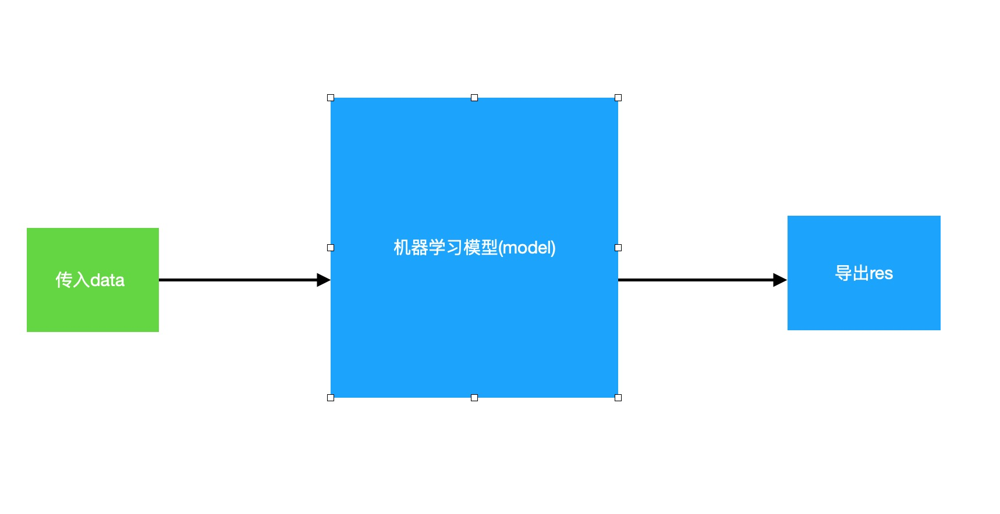
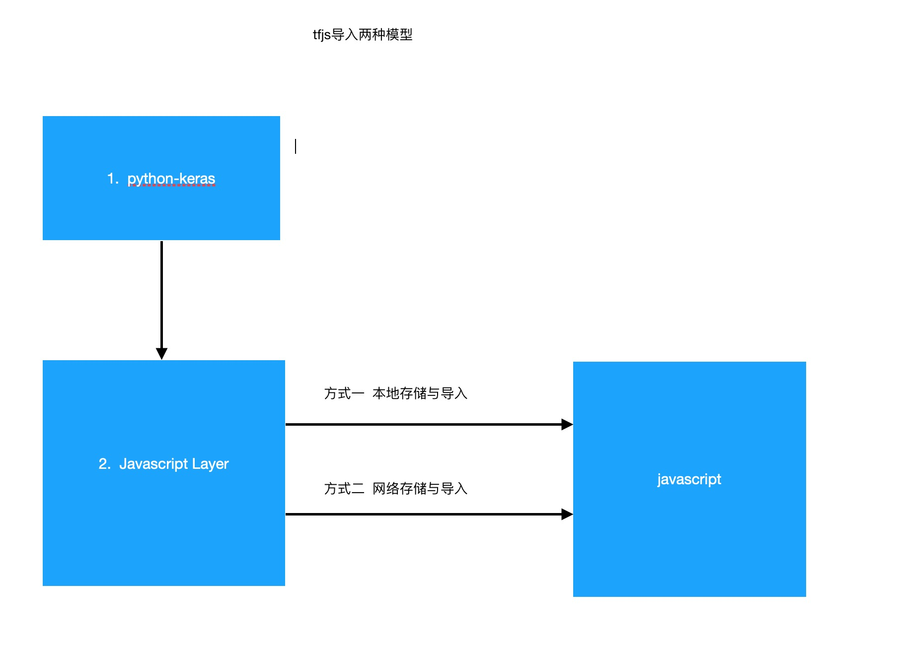

# 大前端技术系列：TWA技术+TensorFlow.js => 集成原生和AI功能的app

## 什么是TWA 
简单来讲，TWA(Trusted Web Activity 可信任的网络应用）即: 基于Chrome Custom Tabs，利用谷歌浏览器提供的api，实现强大功能的桌面应用技术。
如果说你对PWA这个概念有所了解，那么TWA的实现就相当于 PWA + 更丰富的原生API(以实现强大的原生功能)。

如果上面的描述，你依然没有清晰的认知，那么请先阅读下面的PWA和Chrome Custom Tabs介绍，然后再回过头来看这段解释。

### 什么是PWA
PWA(Progressive Web Application)，译 渐进式网络应用程序，它起初的含义是 追求性能无限接近原生app的webapp。
现在它有了更官方的定义：PWA是一种可以提供类似于原生应用程序(native app)体验的网络应用程序(web app)。
whatever，差不多的意思。

PWA可以用来做很多事，包括在离线(offline)时应用程序能够继续运行功能(通过Service Workers技术实现)，以及作为桌面上的一个单独的app(web app)。
如果你对service workers技术尚不太了解，那么你暂时只需要知道它的作用——可以提供离线加载的功能。当然，或许你应该更深入地去学会应用它。

#### PWA的特性
那么通过上述PWA的概念，我想我们可以推断出PWA的以下特性：
+ 优化的性能(你可以通过分包按需加载等一万种方式来优化你的web应用，可以参考雅虎军规等一系列优化标准) 
+ 可以作为一个单独的app(桌面应用-native的能力)
+ 也可以作为网页被浏览器打开(h5的能力)
+ 离线模式(集成了Service Workers)
+ 在线更新内容，不用下载包(h5的能力)

那么到现在为止，你应该理解了PWA是个什么东西————我们甚至可以称它为 桌面H5应用。


### TWA的特性
那么我们回过头来思考TWA应该具备怎样的特性，在这之前，我这里写了这样一个公式： 

PWA + js Bridge(由谷歌浏览器提供的调用更底层能力的api)  == TWA 

这里抛出一个问题，native app和web app的最大的表现区别在哪？ 
我认为，是native app可以直接调用操作系统api的能力。
那么这时候，TWA的特性应当很自然地被我们推断出来： 

+ 优化的性能(你可以通过分包按需加载等一万种方式来优化你的web应用，可以参考雅虎军规等一系列优化标准) 
+ 可以作为一个单独的app(桌面应用-native的能力)
+ 也可以作为网页被浏览器打开(h5的能力)
+ 离线模式(集成了Service Workers)
+ 在线更新内容，不用下载包(h5的能力)
+ (调用)操作系统能力集成（native的能力）

所以说 TWA是集成native-app和web-app优点的app应用技术。

于是，我们大概知道TWA是个怎样的东西了。
但是我们仍然需要继续看下面对Chrome Custom Tabs的介绍，这方面我们更容易理解后面的实现流程。

### Chrome Custom Tabs
这里先放一个官方介绍链接: [Chrome Custom Tabs](https://developer.chrome.com/multidevice/android/customtabs)

Chrome Custom Tabs，译 谷歌自定义标签(或者谷歌定制标签)。
某方面来讲，它跟webview所做的事情相去不远。
#### webview的特点
我们要必要了解下webview的一些特征，以便分析CCT和webview不同的应用场景： 
1. webview的优点 
+ 展示大小可以自由控制，可以全屏幕展示，也可以只展示在一定屏幕空间内。
+ 可方便的与 native 进行交互(webView.addJavascriptInterface => jsBridge)。
+ 可以使用 Service workers（这个上面提到过了，这里说下微拍堂app，应用的也是webview，并且也集成了这个功能）

2. webview的缺点
+ Wevbiew 是一个独立的安全沙盒，这意味着 cookie、storage 都不会与其他浏览器中的页面共享。
（这意味着WebView不会与浏览器共享状态并会因此增加维护开销。）
+ 在低版本的安卓系统中，webivew 是不会随着 Chrome 进行更新的。
+ 最后，Webview 中的 API 支持是有限的，例如以下 API 在 Webview 不被支持:
web push notifications
background sync
Chrome form autofill
Media Source Extensions (MSE)
Sharing API

#### Chrome Custom Tabs的特征
相较于webview，Chrome Custom Tab的特征：
1. 优点
+ 可让应用更好地控制其网络体验，并且无需借助WebView即可在本机内容和网络内容之间无缝切换；
+ 可让应用自定义Chrome的外观和风格；
+ 应用可以更改以下内容：
工具栏颜色
输入和退出动画
将自定义操作添加到Chrome工具栏，溢出菜单和底部工具栏
+ Chrome自定义标签还允许开发人员预先启动Chrome并预取内容，以加快加载速度。(这是一个强大的功能，提供的warmup函数, 可以预先解析DNS。尽管html5标准里也有所实现:pre-xx属性。)
2. 缺点
+ 基于谷歌浏览器嘛，所以必须依赖谷歌浏览器打开。
自Chrome 45中，Chrome的自定义选项卡现已全面上市，给所有用户 的Chrome，在所有Chrome的支持的Android版本（杰利贝恩起）。

#### Chrome Custom Tabs的应用场景
(这部分内容来源于上面的官方链接)
如果您要在应用程序中托管自己的内容，则WebView是很好的解决方案。如果您的应用将用户定向到您域外的URL，则出于以下原因，我们建议您使用Chrome自定义标签：

1. 易于实现。无需构建代码即可管理请求，权限授予或cookie存储。
2. 用户界面自定义：
+ 工具栏颜色
+ 动作按钮
+ 自定义菜单项
+ 自定义输入/输出动画
+ 底部工具栏
3. 导航意识：浏览器在外部导航时向应用程序提供回调。
4. 安全性：浏览器使用Google的安全浏览来保护用户和设备免受危险站点的侵害。
5. 性能优化：
+ 在后台预热浏览器，同时避免从应用程序中窃取资源。
+ 预先向浏览器提供可能的URL，这可能会执行推测性工作，从而加快页面加载时间。
6. 生命周期管理：浏览器通过将应用程序的重要性提高到“前景”级别，从而防止应用程序被系统驱逐。
7. 共享的cookie jar和权限模型，因此用户不必登录到他们已经连接的站点，也不必重新授予他们已经授予的权限。
8. 如果用户打开了Data Saver，他们仍然会从中受益。
9. 跨设备同步自动完成，以更好地完成表格。
10. 简单的定制模型。
11. 轻按一下即可快速返回到应用程序。
12. 您想在Lollipop之前的设备（自动更新WebView）上使用最新的浏览器实现，而不是较旧的WebView。

### TWA技术
当我们了解了 Chrome Custom Tabs，那么我们就很容易理解TWA技术所做的事情了： 
基于Chrome Custom Tabs，隐藏掉地址栏的PWA应用，即为TWA。

你看多简单。
附上官方文档： [TWA官方文档](https://developers.google.com/web/updates/2019/02/using-twa)


## TWA应用的具体实现流程

那么，介绍完TWA，那么我们就讲讲它的实现流程，并且去配合我们的工具和代码去实现它。
实现TWA，我们不需要编写Java代码，但需要Android Studio这个工具。
这里直接附上官方文档： 
+ [Android Studio 下载地址](https://developer.android.com/studio/)
+ [Android Studio 安装文档](https://developer.android.com/studio/install)
注意： 这个工具包(安卓原生编译器)还是挺大的，mac版的700多m。调试方案一般有两种，第一种下载安装虚拟机(包比较大)进行效果预览，第二种直接USB连接真机调试。在下方贴出的Android Studio官方用户指南链接里，有更具体的调试方式。

ok，在download的过程中，泡杯咖啡或者泡杯茶，然后打开下方的官方链接了解一下它吧：
+ [Android Studio官方用户指南](https://developer.android.com/studio/intro/index.html)


### 创建TPA应用
那么，如果你已经下载并安装完毕，那么我们将真正意义上进入开发流程。
值得一提的是：依赖Android Studio这个工具，以及几个写死的配置项，让我们可以屏蔽掉安卓原生层进行TPA的内容开发。但是如果想更深层地掌握TWA技术的话，那么还是需要多了解下安卓原生开发。
当然，在这里我们并不需要去做这些事。用熟悉的技术，屏蔽不熟悉的技术，完成其他端的内容开发，正是混合开发的意义所在。
那么，请仔细按照下方的步骤逐渐实现： 
+ [步骤流程](https://juejin.im/post/5cf50755e51d455d850d3aa7#heading-5)
这是官方文档的中文翻译最好的一版。
你可能会遇到以下问题： 
+ adb命令无法使用  =>  安装并配置path 
亲测嵌过内容w.weipaitang.com(微拍堂官方网站),真机上性能非常强大。

### [这里是个标记:演示整个整个步骤流程]

## TensorFlow.js
TensorFlow.js是TensorFlow在js的实现。
而TensorFlow则是AI > 机器学习 > 深度学习 的一个框架。(后者是前者的子集)

以下内容均来自于下文：
+ [深度学习](https://www.csdn.net/gather_25/MtTaggxsOTQ5MS1ibG9n.html)

我们先来了解下 AI、机器学习、深度学习这三个概念： 
简单来讲， AI 就是我们所说的 人工智能领域； 
而 机器学习 是属于 实现 AI 的一种策略；
而 深度学习 是属于 实现 机器学习 的一种方式;
用一张图片来表达是这样的： <br />


如上图可见，深度学习是机器学习的一个分支，而机器学习是AI的一个分支。
我们再简单了解下它们的学术性概念和相关方法论。

### 什么是机器学习

我们有必要先重新认知下“学习”这个概念： 
赫伯特·西蒙教授（Herbert Simon，1975年图灵奖获得者、1978年诺贝尔经济学奖获得者）曾对“学习”给了一个定义：“如果一个系统，能够通过执行某个过程，就此改进了它的性能，那么这个过程就是学习”。

而机器学习的概念则是：
对于某类任务（Task，简称T）和某项性能评价准则（Performance，简称P），如果一个计算机程序在T上，以P作为性能的度量，随着很多经验（Experience，简称E）不断自我完善，那么我们称这个计算机程序在从经验E中学习了。

那么，根据上述的概念，我们知道，对于一个机器学习的问题，我们要明确这三个概念： 
+ 任务的类型(T)
+ 衡量任务性能提升的标准(P)
+ 获取经验的来源(E)

#### 机器学习的方法论
e(数据来源作为起始端)   =>   e(end，结束端)
中间的过程？
机器学习的方法论就是始端直接到末端，中间过程是不可知的，并且因此难以知 ===> 这就是机器学习。
所以也有很多人批判深度学习是一个黑盒系统，它的性能很好，但却不知道为何而好，也就是说，缺乏解释性。

传统的机器学习方式，通常是用人类的先验知识，把原始数据预处理成各种特征（feature），然后对特征进行分类。
然而，这种分类的效果，高度取决于特征选取的好坏。传统的机器学习专家们，把大部分时间都花在如何寻找更加合适的特征上。

#### 为什么会是黑盒
机器学习的专家们发现，可以让神经网络自己学习如何抓取数据的特征，这种学习的方式，效果更佳。于是兴起了特征表示学习（feature representation learning）的风潮。
这种学习方式，对数据的拟合也更加的灵活好用。于是，人们终于从自寻“特征”的中解脱出来。

但这种解脱也付出了代价，那就是机器自己学习出来的特征，它们存在于机器空间，完全超越了人类理解的范畴，对人而言，这就是一个黑盒世界。为了让神经网络的学习性能，表现得更好一些，人们只能依据经验，不断地尝试性地进行大量重复的网络参数调整。

#### 深度学习
再后来，网络进一步加深，出现了多层次的“表示学习”，它把学习的性能提升到另一个高度。这种学习的层次多了，就给它取了个特别的名称——Deep Learning（深度学习）。

### 我们不训练模型，我们只做模型的搬运工
上面的概念知识如果你没有看懂(这是大概率的事情)，那么无妨，因为我们的目的并不是训练出针对某种任务类型的模型，而是在应用内集成某种任务的AI能力,因此我们并不需要训练，只需“搬运”即可。
<br />
 
所以本次分享主题的由来：
1. 由于客户端的限制(主要是性能考虑)，所以这些由机器学习(框架+模型)构建的功能，大多情况是我们把入参数据发送到服务端，让服务端来处理数据，把res返回到客户端。这样做无疑会带来以下几点问题： 
+ 用户的隐私不能得到保证(入参会经过网络传输到服务端)；
+ 返回数据的用时依赖网速；
+ 服务端压力大；

2. 由于html5新增的功能(webGL)和越来越强大的性能(环境日益改善)，一些可以运行在客户端的小型但又强大的机器学习框架衍生出来(比如tensorflow.js)，可以在客户端完成这些功能。好处也是显而易见的：
+ 用户的隐私得到了保证； 
+ 不依赖网速，依赖客户端的性能；
+ 所以不会对服务端造成任何压力；

3. 综上所述机器学习很牛逼，属于大前端领域的一个支线技能。
<br />
举个例子： 
小明想一夜暴富，于是他想预测下次的彩票开奖结果。
那么他确定了任务类型： 预测下次彩票开奖的结果。
于是小明向好基友AI大佬小华求助。
于是小华把训练好的模型给了小明，告诉他，只要对模型入参(E)开奖的日期"yyyy-mm-dd"，就会得出一个开奖结果(E)"x x x x x x x x" ; 
于是小明就上车了。

小明第一次入参 2019-11-07， 得出结果：  1 2 3 4 5 6 7

小明坚信不疑，当场花了两元巨款，结果第二天就发现打了水漂——因为开奖结果是： 2  9 8 6 6 4 4

小明就问小华怎么回事，经过小华的解释，小明明白了： 

#### 损失
实际输出值和预期输出值之间存在着“误差”，这种“误差”在AI术语里被称作loss(损失)。而模型训练师们，也是把loss当做训练的把手。(loss值越小，说明模型训练的越成功嘛)

所以我们在使用模型的时候，未必能得出正确的答案。因为模型得出的结果会存在loss。
比如说，前阵子公司里app组的大佬们写了一个 程序员鉴定 app。入参 人物图像， 得出图像中人物为程序员的概率。
经过大家的鉴定，有些结果与现实存在一定误差。 

### 什么是Tensorflow.js？

TensorFlow.js是一个开源的基于硬件加速的JavaScript库，用于训练和部署机器学习模型。谷歌推出的第一个基于TensorFlow的前端深度学习框架TensorFlow.js 是一个开源的用于开发机器学习项目的 WebGL-accelerated JavaScript 库。TensorFlow.js 可以为你提供高性能的、易于使用的机器学习构建模块，允许你在浏览器上训练模型，或以推断模式运行预训练的模型。TensorFlow.js 不仅可以提供低级的机器学习构建模块，还可以提供高级的类似 Keras 的 API 来构建神经网络。


### Tensorflow.js的优点：

1. 不用安装驱动器和软件，通过链接即可分享程序

2. 网页应用交互性更强

3. 有访问GPS，Camera，Microphone，Accelerator，Gyroscope等传感器的标准api（主要是指手机端）

4. 安全性，因为数据都是保存在客户端的


### TensorFlow.js的应用方式：
1. 在浏览器中开发ML

使用简单直观的API从头构建模型，然后使用低级别的JavaScript线性代数库或高层API进行训练。

2. 运行现有模型     ~~~我们不生产模型，我们只是模型的搬运工

使用TensorFlow.js模型转换器在浏览器中运行预训练好的TensorFlow模型。

3. 重新训练现有模型

使用连接到浏览器的传感器数据或其他客户端数据重新训练ML模型。


###  tfjs 训练模型
// to  tfjs_0.html

###  tfjs导入模型的方式  
<br/>

<br/>
js-layers格式(就是我们tfjs生成的model格式) 与 python-keras格式,  对应不同语言环境(js,python)下的两种模型格式。

### js导入layers

```js
    // tf.loadLayersModel
    const model = await tf.loadLayersModel('https://foo.bar/tfjs_artifacts/model.json');
```

### 存储 
```js
//  model.save();
// 本地存储（浏览器）   localstorage://  
await model.save('localstorage://my-model-1');

// IndexedDB（浏览器） indexeddb://    
await model.save('indexeddb://my-model-1');
//IndexedDB 是大多数主流Web浏览器支持的另一个客户端数据存储。与本地存储不同，它更好地支持存储大型二进制数据（BLOB）和更大的配额。因此，tf.Model与本地存储相比，保存到IndexedDB通常可以提供更好的存储效率和更大的大小限制。

// 触发文件下载到客户端本地保存（浏览器） downloads://    
await model.save('downloads://my-model-1');     //json + 一个二进制文件


// HTTP请求（浏览器） http:// 要么 https://   POST请求的主体具有一个名为的格式 multipart/form-data。它是用于将文件上载到服务器的标准MIME格式。正文由两个文件组成，文件名model.json和文件名 model.weights.bin。
await model.save('http://model-server.domain/upload');   //简单的写法
await model.save(tf.io.browserHTTPRequest(       //更详细的写法，便于控制post需求
    'http://model-server.domain/upload',
    {method: 'PUT', headers: {'header_key_1': 'header_value_1'}}));


// 文件系统（Node.js）   file://              node-tf.js node端本地生成文件储存
await model.save('file:///tmp/my-model-1');
```


###  layers 转 Keras 
转keras是为了让python用   在python环境下 下载tensorflowjs这个转换器，即可将js-layers格式的模型转为python-keras模型
方案：
+ 使用该file://方案将模型直接写入Node.js中的本机文件系统 。使用tensorflowjs转换器，您可以将这些文件转换为HDF5格式，然后可以将其加载到Python中的Keras中。例如：
```linux
pip install tensorflowjs

tensorflowjs_converter \
    --input_format tensorflowjs --output_format keras \
    ./my-model-1.json /tmp/my-model-1.h5
```
+ 通过文件从Web浏览器下载，使用该downloads://方案


###  tfjs官方模型社区资源
https://github.com/tensorflow/models/tree/master/research/slim


  


